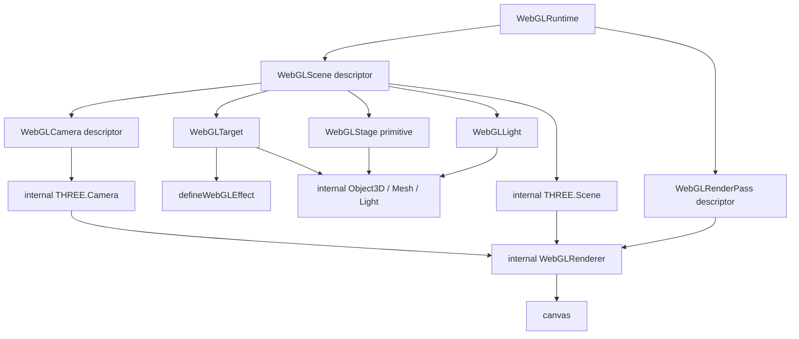
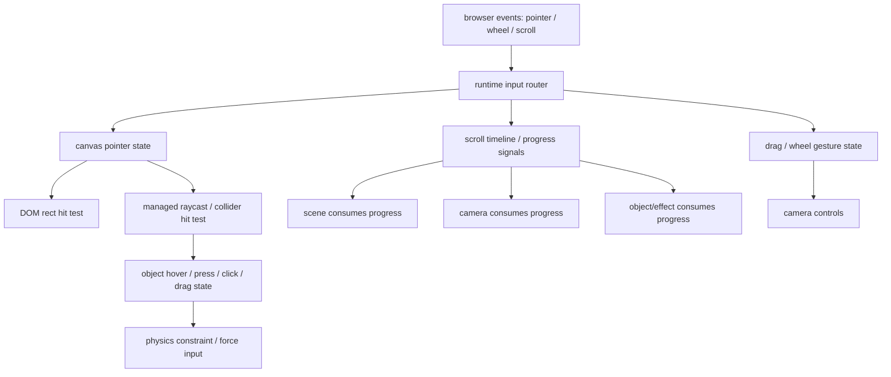

# Managed Render System Roadmap

> Strategic roadmap only. This document is not an implementation plan and should
> not be executed task-by-task. Before implementation, write a focused
> `docs/superpowers/plans/YYYY-MM-DD-<phase>.md` plan for the selected phase.

**Date:** 2026-07-03
**Baseline discussed at:** `b641a93f Tame model glow example`
**Last reviewed against:** `b37bd111 fix: broaden postprocess bloom spread`
**Status:** Direction-setting roadmap

## North Star

Build a DOM-first managed WebGL render system.

DOM remains the authoring anchor. Consumers declare DOM targets, managed scenes,
cameras, stage objects, lights, effects, and render passes. The runtime owns
Three.js renderer, scene, camera, raw objects, materials, textures, render
targets, render loop, resource lifetime, fallback visibility, scroll, pointer,
and scheduling.

This is not a React Three Fiber clone and not a raw Three.js wrapper. The package
may borrow Three.js and R3F vocabulary where it improves authoring clarity, but
the public contract must stay descriptor-driven and runtime-managed.

## Current Runtime Truth

- One runtime instance creates one fixed transparent canvas.
- The default runtime host creates one main internal Three `Scene`, one main
  `OrthographicCamera`, and one `WebGLRenderer`.
- `WebGLTarget` is the current DOM authoring anchor.
- Existing target sources compile into internal renderables:
  - `dom/element`: canvas-backed plane.
  - `dom/text`: text rasterized into a canvas-backed plane.
  - `media/image`: image texture plane.
  - `media/video`: video texture plane.
  - `media/image-sequence`: frame texture plane.
  - `model/glb`: loaded GLB scene wrapped in a runtime group.
- Public effect authoring is `defineWebGLEffect(...)` plus `ctx.object`.
- `ctx.object` already exposes controlled transform, material, lights,
  animation, surface, text, texture, video, model, model mesh/material, model
  point layer, material layer shader, and postprocess request capabilities.
- Raw Three.js renderer, scene, camera, object, mesh, material, texture,
  render target, pass ordering, render loop, loader, mixer, and raycaster remain
  internal.
- `ctx.object.postprocess` currently requests runtime-canvas-scoped bloom,
  blur, and grain. It is not target/model scoped.
- `example.model.float-glow` intentionally uses emissive material controls and a
  runtime-owned point light instead of canvas-scoped postprocess bloom.
- `example.model.dark-scene` is a `dom/element` surface: an unlit canvas texture
  plane, not a managed lit stage primitive.
- Current `transformScope: "subtree"` creates internal transform groups from the
  DOM target tree, but it is not a public raw scene graph.

## Product Thesis

The runtime should evolve from a set of target-local capabilities into a managed
render system:

```text
DOM target
  -> managed scene / layer
  -> managed camera / projection policy
  -> managed stage objects and lights
  -> managed effects
  -> managed render passes
  -> one or more internal Three render operations
  -> canvas
```

The public model should be:

```text
WebGLTarget     -> belongs to a WebGLScene
WebGLModel      -> optional scene-native model descriptor
WebGLStage      -> scene-native managed primitive descriptor
WebGLCamera     -> belongs to a WebGLScene
WebGLRenderPass -> renders one WebGLScene with one WebGLCamera
Effect          -> acts on object, scene, camera, or runtime scope
```

The internal model can still use Three.js:

```text
WebGLScene descriptor     -> internal THREE.Scene or scene layer
WebGLCamera descriptor    -> internal THREE.Camera
WebGLStage primitive      -> internal THREE.Mesh / Geometry / Material
WebGLLight descriptor     -> internal THREE.Light
WebGLRenderPass descriptor-> internal render(scene, camera) and framebuffer work
```

Consumers should not receive the raw objects created by this mapping.

## Why This Direction

The current system has strong DOM-to-WebGL anchoring, but it lacks a public
space/stage/world concept. That leads to repeated one-off capability requests:
model glow, lit backdrop, wall/floor, target-local bloom, postprocess scope,
picking, and future physics.

The missing abstraction is not another `ctx.object.model.*` method. The missing
abstraction is a managed render model that can describe:

- which scene/layer an object belongs to;
- which camera views that scene;
- how DOM rects project into that scene;
- what stage primitives live in that scene;
- which lights affect them;
- which passes draw them to canvas;
- which postprocess effects apply to a pass or canvas.

## Public API Direction

Prefer a React component authoring layer that compiles into lower-level runtime
descriptors.

Example direction:

```tsx
<WebGLRuntime>
  <WebGLScene id="world">
    <WebGLCamera
      id="main"
      default
      type="perspective"
      position={[0, 2, 8]}
      target={[0, 0, 0]}
    />

    <WebGLStagePlane
      id="floor"
      size={[1200, 800]}
      position={[0, -260, -80]}
      rotation={[-Math.PI / 2, 0, 0]}
      material={{
        kind: "standard",
        color: "#05070a",
        roughness: 0.8,
      }}
    />

    <WebGLLight
      id="hero-glow"
      kind="point"
      color="#7dd3fc"
      intensity={1.8}
      position={[0, 0, 160]}
    />

    <WebGLTarget
      webgl={{
        key: "hero-model",
        source: { kind: "model", type: "glb", src: "/models/hero.glb" },
        effects: [{ kind: "app.modelFloat" }],
      }}
    />
  </WebGLScene>

  <WebGLScene id="overlay">
    <WebGLCamera id="screen" default type="orthographic" mode="screen" />

    <WebGLTarget
      webgl={{
        key: "hud-title",
        source: { kind: "dom", type: "text" },
      }}
    >
      HUD Title
    </WebGLTarget>
  </WebGLScene>

  <WebGLRenderPass scene="world" camera="main" />
  <WebGLRenderPass scene="overlay" camera="screen" clearDepth />
</WebGLRuntime>
```

Rules:

- `WebGLTarget` inherits the nearest `WebGLScene` by React context.
- `WebGLScene` owns a default camera.
- `WebGLTarget` belongs to a scene, not directly to a camera.
- `WebGLRenderPass` chooses which scene and camera to render.
- The runtime may auto-create a pass only for the default `main` scene.
- Additional scenes require an explicit `WebGLRenderPass` or an explicit
  `defaultPass` declaration.
- Non-React consumers use equivalent descriptors with explicit `sceneId`,
  `cameraId`, and `pass` fields.
- `WebGLTarget` remains DOM-backed and owns fallback/lifecycle behavior.
- Scene-native descriptors such as `WebGLModel`, `WebGLStagePlane`, and
  `WebGLLight` do not require DOM anchors or fallback DOM.

## Concept Relationships



## Scope Model

The effect context should eventually make scope explicit:

```text
ctx.object  -> current target/renderable object facade
ctx.scene   -> managed scene/layer scoped controls
ctx.camera  -> controls for a specific managed camera context
ctx.runtime -> runtime/canvas scoped controls
```

This does not mean all scopes need to ship at once. It means new capabilities
should be placed according to their real ownership:

- target transform, material, texture, text, model modules: `ctx.object`;
- scene lighting, environment, stage coordination: `ctx.scene`;
- camera progress/motion/focus/framing: camera-scoped descriptors or
  `ctx.camera` only when bound to a specific camera/pass context;
- render pass and canvas-wide postprocess: `ctx.runtime` or pass-scoped API.

Target-local effects should not assume an implicit "current camera" in
multi-camera or multi-pass scenes. Camera mutation should be authored on camera
descriptors/controllers, or through an explicit named camera binding.

## Input and Interaction Ownership

Browser events belong to the runtime boundary, not to individual Three objects.
Three.js `Object3D` instances do not receive DOM pointer or scroll events by
themselves. The runtime should capture input once, normalize it, route it, and
then let managed scene/camera/object/physics consumers opt in.



Design rule:

```text
Capture input once at runtime/canvas/scroll-provider scope.
Route input through managed hit tests and priority rules.
Let scenes, cameras, targets, stage objects, and physics bodies consume signals.
Do not let user code attach raw DOM listeners to internal Three objects.
```

Consumption scopes:

- `ctx.runtime`: canvas-level pointer state, scroll adapters, scroll timelines,
  input capture, and global routing diagnostics.
- `ctx.scene`: scene-local pointer coordinates, scene hover/active state, and
  scene-wide progress-driven controllers.
- `ctx.camera`: pointer parallax, scroll dolly, orbit/trackball-style managed
  controllers, focus, and framing.
- `ctx.object`: target/object hover, press, click, drag, local pointer state, and
  object-local progress.
- future physics scope: drag constraints, forces, impulses, collision events,
  and body transforms.

Routing priority should be explicit:

```text
active pointer capture
  -> active physics/object drag constraint
  -> newly hit pickable object
  -> scene/camera empty-space controls
  -> passive pointer/progress effects
```

Examples:

- Whole-scene pointer parallax usually belongs to `ctx.camera` when it means
  "move the viewer" and to `ctx.scene` when it means "move a managed layer".
- Dragging empty space to rotate the view is a managed camera controller.
- Dragging a model to rotate it is an object controller.
- Dragging a 3D body with realistic inertia is a physics constraint built on top
  of managed hit testing and collider descriptors.

Compatibility with the current runtime:

- Existing `ctx.pointer` remains runtime/canvas pointer state.
- Existing `ctx.targetPointer` remains DOM-target-local pointer state.
- Existing pointer declarations (`hover`, `press`, `click`, `drag`) remain
  target-scoped and DOM-rect based.
- Future 3D picking should add scene/object hit state beside this model, not
  replace current DOM-first pointer behavior.

## DOM Rect Projection Contract

DOM rect mapping remains a core differentiator. Multiple scenes and cameras do
not remove DOM anchoring. They require explicit projection policies.

Separate two ideas:

- **Projection policy**: how a scene/camera maps coordinates.
- **Placement mode**: where an object gets its position from.

Projection policies:

### `dom-aligned`

Default current behavior.

```text
DOM rect center -> orthographic scene position
DOM rect size   -> plane/model fit extent
```

Use for the default `main` scene, text, DOM surfaces, media planes, and existing
examples.

### `screen`

Screen-space overlay behavior.

```text
DOM rect -> overlay orthographic coordinates
render pass -> after world/main pass, usually with clearDepth
```

Use for HUD, labels, markers, annotations, and screen UI.

### `perspective-stage`

3D world behavior.

Possible placement modes:

```text
screen-depth: DOM rect projects to a fixed camera depth
screen-plane: DOM rect center casts a ray to a named plane
screen-billboard: target becomes a camera-facing plane at a chosen depth/plane
stage-local: descriptor uses explicit world/stage coordinates
```

Use for models or stage objects that must participate in a real 3D space.

## Placement Modes

Placement modes answer: "what owns this object's position?"

### `dom-anchored`

The object is anchored to a real DOM element.

```text
DOM getBoundingClientRect()
  -> scene/camera projection policy
  -> object position and size
```

Use for DOM text, DOM element surfaces, image/video targets, DOM-driven cards,
and models that should follow a page section or element.

Example direction:

```tsx
<WebGLTarget
  webgl={{
    key: "hero-title",
    source: { kind: "dom", type: "text" },
    placement: { mode: "dom-anchored" },
  }}
>
  Hero Title
</WebGLTarget>
```

This is the default for `WebGLTarget` because it preserves the current
DOM-to-WebGL contract.

### `screen-anchored`

The object is anchored to the canvas/screen, not a DOM element.

```text
screen anchor / pixel offset
  -> screen orthographic scene coordinates
  -> object position
```

Use for HUD, fixed labels, reticles, minimap frames, screen annotations, and
overlay UI that should not move with document layout.

Example direction:

```tsx
<WebGLLabel
  id="fps"
  placement={{
    mode: "screen-anchored",
    anchor: "top-right",
    offset: [-24, 24],
  }}
/>
```

### `stage-local`

The object is placed directly in the managed scene's own coordinate system.

```text
position / rotation / scale descriptor
  -> world/stage local coordinates
  -> object transform
```

Use for pure 3D scene objects that may have no DOM counterpart: floors, walls,
backdrops, lights, decorative objects, physics bodies, particles, and models in
a fully scene-native world.

Example direction:

```tsx
<WebGLModel
  id="robot"
  src="/models/robot.glb"
  placement={{
    mode: "stage-local",
    position: [0, 0, 0],
    rotation: [0, Math.PI, 0],
    scale: 1.2,
  }}
/>
```

This is the bridge from DOM-first runtime to managed 3D scenes. It allows one
scene to be purely Three-like in behavior while still using runtime-owned
descriptors and lifecycle.

## Render Pass Contract

Render passes should be limited in v1. Do not expose arbitrary render targets or
composer pass objects in the default API.

Initial pass fields:

```ts
type WebGLRenderPassDeclaration = {
  id?: string;
  scene: string;
  camera?: string;
  order?: number;
  clear?: boolean;
  clearDepth?: boolean;
  viewport?: {
    x: number | string;
    y: number | string;
    width: number | string;
    height: number | string;
  };
  postprocess?: WebGLPostprocessDeclaration;
};
```

Default pass behavior:

- Single scene/camera apps get one generated pass.
- Only the default `main` scene receives an implicit generated pass.
- Additional scenes must opt into rendering with `WebGLRenderPass` or
  `defaultPass`.
- Overlay passes default to `clearDepth: true`.
- Minimap or picture-in-picture passes use `viewport`/scissor.
- Postprocess is pass/canvas scoped, not object scoped.

## Roadmap

### Phase 0: Direction and Boundary Alignment

Goal: make the final model clear before implementation.

Deliverables:

- Add this roadmap.
- Update high-level docs later to point to the selected roadmap once approved.
- Define terminology:
  - `WebGLScene` is managed scene/layer, not raw `THREE.Scene`.
  - `WebGLCamera` is managed camera descriptor, not raw `THREE.Camera`.
  - `WebGLRenderPass` controls render order and composition.
  - `WebGLTarget` remains the DOM anchor.
- Confirm non-goals:
  - no default raw Three.js object exposure;
  - no R3F internal rewrite;
  - no arbitrary composer/pass graph in v1;
  - no physics before stable stage/collider semantics.

Validation:

- Docs describe current truth and future direction separately.
- No code behavior changes.
- `git diff --check` is enough for this docs-only phase.

### Phase 1: Internal Render Layer Foundations

Goal: refactor internal state to make scene/camera/pass concepts explicit while
preserving current behavior.

Current behavior should compile to:

```text
scene: main
camera: main
pass: render(main, main)
```

Implementation direction:

- Introduce internal scene registry with one default `main` entry.
- Introduce internal camera registry with one default DOM-aligned orthographic
  camera.
- Introduce internal pass list with one generated pass.
- Keep existing `createThreeRendererHost` behavior as the default host.
- Preserve existing target registration, layout measurement, fallback,
  lifecycle, scroll, pointer, and effect scheduling semantics.

Acceptance criteria:

- All current tests pass.
- Existing public API is unchanged.
- Debug state can still describe current target counts and renderable counts.
- No consumer-visible multi-scene feature is required yet.

### Phase 2: Component Declarations for Scene, Camera, and Pass

Goal: add managed React declarations without exposing raw Three.js objects.

Public direction:

```tsx
<WebGLRuntime>
  <WebGLScene id="world">
    <WebGLCamera id="main" default type="perspective" />
    <WebGLTarget webgl={{ key: "model", source }} />
  </WebGLScene>

  <WebGLRenderPass scene="world" />
</WebGLRuntime>
```

Rules:

- `WebGLTarget` inherits nearest `WebGLScene`.
- `WebGLScene` can declare a default camera.
- `WebGLRenderPass` picks scene and camera.
- Existing `WebGLTarget` outside any `WebGLScene` falls back to `main`.
- Scenes other than `main` do not render unless explicitly passed.
- Runtime descriptor API should support the same model without React context.

Acceptance criteria:

- Current examples can run unchanged.
- New tests prove target scene inheritance.
- New tests prove duplicate scene/camera ids produce controlled diagnostics.
- Public contract tests reject raw `THREE.Scene` and `THREE.Camera` handles.

### Phase 3: Projection Policies

Goal: formalize how DOM rects map into each managed scene/camera type.

Deliverables:

- `dom-aligned` policy for current behavior.
- `screen` policy for overlay scenes.
- `perspective-stage` policy design and at least one initial placement mode.
- Placement modes:
  - `dom-anchored` for existing DOM-driven targets;
  - `screen-anchored` for overlay/HUD objects;
  - `stage-local` for pure scene-native 3D objects.
- Debug records report projection policy and scene id for each target.

Open decision:

- First `perspective-stage` mode should likely be `screen-depth` or
  `screen-plane`. `screen-plane` is better for real stage placement but requires
  a named stage plane to exist.

Acceptance criteria:

- DOM-aligned scenes preserve existing rect-to-plane behavior.
- Overlay scenes render screen-space content without world depth interference.
- Perspective stage mapping has explicit, testable math.

### Phase 4: Managed Stage Primitives

Goal: introduce real lit scene substrate.

Public direction:

```tsx
<WebGLScene id="world">
  <WebGLCamera id="main" default type="perspective" />

  <WebGLStagePlane
    id="floor"
    role="floor"
    size={[1200, 800]}
    material={{ kind: "standard", color: "#05070a", roughness: 0.8 }}
  />

  <WebGLStagePlane
    id="backdrop"
    role="backdrop"
    material={{ kind: "standard", color: "#020617" }}
  />

  <WebGLLight id="ambient" kind="ambient" intensity={0.2} />
  <WebGLLight id="hero" kind="point" intensity={1.8} position={[0, 0, 160]} />
</WebGLScene>
```

Initial primitive set:

- `plane`;
- `box`;
- role aliases: `floor`, `wall`, `backdrop`;
- material descriptors: `basic`, `standard`;
- light descriptors: `ambient`, `directional`, `point`.

Rules:

- Stage primitives are internal meshes, not raw `THREE.Mesh`.
- Materials are descriptors or managed facades, not raw `THREE.Material`.
- Lights are keyed runtime-owned objects.
- Stage objects participate in the scene's lighting and depth.

Acceptance criteria:

- A point light can visibly affect a floor/backdrop with standard material.
- Existing `dom/element` surfaces remain unlit unless explicitly materialized as
  stage primitives.
- Runtime owns disposal for geometry, material, texture, light, and generated
  objects.

### Phase 5: Target Routing and Effect Scope

Goal: make target, scene, camera, and runtime scopes explicit.

Deliverables:

- `WebGLTarget` routing by component context and descriptor fallback.
- Scope-specific effect context exploration:
  - `ctx.scene` for managed scene controls;
  - `ctx.camera` for explicit camera-bound controls;
  - `ctx.runtime` for canvas/pass scoped controls.
- Keep `ctx.object` focused on the current target/renderable.

Rules:

- Do not keep adding renderer-level capabilities under `ctx.object`.
- Do not make targets choose cameras by default.
- Camera is selected by render pass, not object ownership.
- Target-local effects do not receive an implicit active camera in multi-pass
  scenes.
- Camera effects/controllers must bind to an explicit camera descriptor or pass
  context.

Acceptance criteria:

- Existing target-local effects keep working.
- New scene/camera controls are clearly scoped and documented.
- Public tests reject raw scene/camera access.

### Phase 6: Postprocess Scope Correction

Goal: move postprocess out of object-local mental model.

Current issue:

```text
ctx.object.postprocess.request(...)
```

looks object-local, but it affects the runtime canvas.

Target direction:

```ts
ctx.runtime.postprocess.request({
  key: "scene.cinematic",
  scope: { pass: "world" },
  grain: { amount: 0.04 },
});
```

or descriptor-level:

```tsx
<WebGLRenderPass
  scene="world"
  postprocess={{
    grain: { amount: 0.04 },
    bloom: { strength: 0.35 },
  }}
/>
```

Migration:

- Keep `ctx.object.postprocess` temporarily with deprecation docs or a clear
  runtime-canvas warning.
- Prefer pass/canvas scoped naming in all new docs and examples.

Acceptance criteria:

- Model-local glow examples use material/emissive/lights, not canvas bloom.
- Canvas/pass postprocess examples explicitly communicate whole-pass scope.
- Debug state reports active postprocess requests by pass/canvas scope.

### Phase 7: Managed Model Animation

Goal: turn complete animated GLB assets into managed runtime-driven behavior
without exposing raw `AnimationMixer`, `AnimationAction`, `Bone`, `Skeleton`, or
morph target arrays.

Current baseline:

- The runtime already supports basic model clip playback through
  `ctx.object.animation`.
- The runtime creates and owns the `AnimationMixer` for GLB `animations`.
- Effects can list clips, play clips, stop clips, stop all clips, and set mixer
  time.
- Mixers update through runtime scheduling and stop updating when the model is
  not visible.

Model asset requirements:

- Whole-model transform animation requires no special GLB data.
- Clip playback requires exported GLTF/GLB `animations` with stable clip names.
- Skeletal animation requires `SkinnedMesh`, bones, skeleton, and skin weights.
- Morph animation requires morph target attributes and stable morph target names
  or indices.
- Bone-level controls and attachments require stable exported bone names.
- Physics-driven movement requires colliders and belongs to Phase 9, not this
  phase.

Capabilities:

- Declarative clip defaults on model descriptors:
  - clip name;
  - loop mode;
  - time scale;
  - fade in/out;
  - clamp when finished.
- Progress-driven clip scrubbing from scroll timelines or effect progress.
- Clip blending and crossfade between named actions.
- Additive animation layer descriptors for breathing, idle overlays, or small
  secondary motion.
- Managed morph target facade:
  - list targets;
  - set target weight by name;
  - animate target weights from progress or time.
- Managed rig metadata:
  - list named clips, morph targets, and optionally named bones;
  - expose capability diagnostics for missing clips/morphs/bones.
- Optional managed attachment points for named bones without exposing raw
  `Bone` objects.

Public direction:

```tsx
<WebGLModel
  id="character"
  src="/models/character.glb"
  placement="stage-local"
  animation={{
    defaultClip: "Idle",
    loop: "repeat",
    transitions: [{ from: "Idle", to: "Walk", fadeMs: 240 }],
  }}
/>
```

Future effect direction:

```ts
defineWebGLEffect({
  kind: "app.characterScroll",
  update(ctx, _state, params) {
    const progress = ctx.progress.get(params.progressKey);
    ctx.object.animation?.play("Walk", { loop: "repeat" });
    ctx.object.animation?.setTime(progress * 1.4);
    ctx.object.model?.morphs?.set("Smile", progress);
  },
});
```

Rules:

- Keep raw Three animation internals private.
- Do not expose direct `AnimationMixer`, `AnimationAction`, `Bone`, `Skeleton`,
  or `morphTargetInfluences`.
- Do not promise procedural character animation for static, unrigged models.
- Do not couple clip playback to React or GSAP; playback is runtime-owned.
- Treat missing clip/morph/bone names as controlled diagnostics, not crashes.

Acceptance criteria:

- A complete animated GLB can declare and play a default clip without custom
  effect code.
- An effect can scrub a named clip from a timeline/progress signal.
- Two clips can crossfade through managed options.
- A named morph target can be driven by progress or time without raw mesh access.
- Debug state can report available clips and active clips for a model.
- Existing basic `ctx.object.animation` effects keep working.

### Phase 8: Interaction and Picking

Goal: support interaction in managed 3D scenes without exposing raw `Raycaster`.

Capabilities:

- runtime-owned input router with explicit priority;
- scene-local pointer coordinates;
- target-local pointer for projected targets;
- managed raycast/hit-test request API;
- pickable descriptors for stage primitives and models;
- camera interaction controllers for pointer parallax, orbit, pan, and drag;
- optional collider descriptors on stage primitives and models;
- events or effect-readable hit state.

Rules:

- Objects do not capture DOM events directly.
- Do not expose raw raycaster or intersection objects.
- Do not expose raw camera controls as the default contract.
- Do not promise inverse-transformed picking for all transform-group cases until
  the projection and collider contracts are stable.
- Keep DOM pointer capture and canvas coordinate truth owned by the runtime.
- Camera and object interaction controllers in this phase are kinematic input
  controllers, not physics simulations.
- Defer realistic physics drag to Phase 9; Phase 8 may support managed object
  drag without inertia or collision simulation.

Acceptance criteria:

- A stage primitive can receive managed hover/click state.
- A model can expose coarse hit regions or mesh-level managed hits.
- Empty-space drag can drive a managed camera controller without stealing object
  drag.
- Object drag can capture the pointer and release it predictably.
- Existing DOM-first pointer behavior is preserved.

### Phase 9: Dynamics and Physics

Goal: add motion systems after stage and collider contracts exist.

Possible layers:

- simple springs and constraints;
- spring-based follow/lag/orbit controllers;
- optional physics adapter;
- collider descriptors;
- collision events;
- pointer-drag constraints built on Phase 8 hit state.

Rules:

- Do not ship physics before there is a stable managed space and collider model.
- Do not expose a physics engine object as the default public contract.
- Physics should produce managed transforms that still flow through runtime
  scheduling and disposal.
- Pointer input should feed managed constraints, forces, or impulses instead of
  letting consumers mutate raw physics bodies directly.

Acceptance criteria:

- Stage-local objects, stage primitives, and eligible model targets can
  participate in basic constraints.
- Pointer dragging can move a managed body through a constraint or force model.
- Physics or dynamics pause/dispose with runtime lifecycle.
- The runtime remains compatible with static, non-physics pages.

### Phase 10: Advanced Escape Hatch Decision

Goal: decide whether an explicit unsafe escape hatch is still necessary after
managed scenes, cameras, stage, pass, picking, and dynamics exist.

Possible shape:

```ts
unstable_unsafeThree?: {
  onBeforeRender?(context: UnsafeThreeContext): void;
}
```

Rules if accepted:

- Must be explicit opt-in.
- Must be isolated from the default effect context.
- Must not be required for documented examples.
- Must clearly state compatibility and lifecycle risks.
- Must not let consumers own the primary render loop.

Preferred outcome:

- Avoid this unless real downstream needs remain blocked by managed descriptors.

## Scroll, GSAP, and Progress Ownership

Scroll and animation libraries should not own the renderer, scene, camera, or
render loop.

Preferred flow:

```text
Lenis / GSAP / ScrollTrigger / native scroll
  -> progress signal or scroll adapter
  -> runtime frame input
  -> effect/camera/stage controller reads progress
  -> runtime syncs and renders once
```

Current `ScrollEffectSection` positioning:

- It is a good v1 React bridge, not the final core abstraction.
- It correctly keeps GSAP/ScrollTrigger outside runtime core.
- It owns a React DOM ref, creates one bounded trigger, writes
  `progressKey -> progress`, and cleans up its own trigger.
- The reusable part is the progress/timeline signal, not the exact component
  name or effect-specific framing.

Preferred React evolution:

```tsx
<WebGLScrollTimeline
  id="hero.3d"
  as="section"
  className="hero-section"
  start="top top"
  end="+=300%"
  pin
  scrub
>
  <HeroDomContent />

  <WebGLScene id="heroScene" timeline="hero.3d">
    <WebGLCamera id="main" />
    <WebGLModel placement="stage-local" source={modelSource} />
  </WebGLScene>
</WebGLScrollTimeline>
```

This keeps the React adapter idiomatic: the component that creates the scroll
timeline also owns the DOM node ref and lifecycle.

Avoid making this the primary React API:

```tsx
<WebGLScrollTimeline
  id="hero.3d"
  trigger="hero-section"
  start="top top"
  end="+=300%"
  pin
  scrub
/>
```

The `trigger` descriptor style is acceptable only for lower-level non-React or
imperative runtime integration where the caller can pass an actual `Element` or
descriptor. React should prefer composition and refs over DOM queries.

Long-term naming direction:

- `ScrollEffectSection` may remain as compatibility sugar for target/effect
  pinned sections.
- The broader abstraction should be `WebGLScrollTimeline` or
  `WebGLScrollSection`.
- Scene, camera, target, image-sequence, and stage-local objects should all be
  able to consume the same timeline signal.

Camera motion should be declared as managed progress-driven behavior or authored
inside effects/controllers that stay within runtime-owned facades.

Do not encourage:

```ts
gsap.to(rawCamera.position, ...);
rawScene.add(...);
renderer.render(...);
```

## R3F Relationship

React Three Fiber solves a different product:

```text
React components directly declare Three.js objects.
```

This runtime solves:

```text
DOM elements and managed descriptors compile into runtime-owned Three.js output.
```

Borrow from R3F:

- JSX authoring ergonomics;
- component composition;
- scene/camera/light/material vocabulary;
- ecosystem lesson that direct render-loop state updates are risky.

Do not borrow by default:

- raw Three refs as public contract;
- full JSX mapping of every Three class;
- R3F as internal renderer dependency;
- consumer-owned scene graph mutation.

## Migration Strategy

Compatibility matters. Existing consumers should not need to understand scenes
or passes.

Default behavior remains:

```tsx
<WebGLRuntime>
  <WebGLTarget webgl={{ key: "title", source: { kind: "dom", type: "text" } }}>
    Title
  </WebGLTarget>
</WebGLRuntime>
```

Internally this becomes:

```text
scene: main
camera: main
projection: dom-aligned
pass: main -> canvas
```

Only advanced users opt into:

- additional scenes;
- perspective stage cameras;
- scene-native `stage-local` objects;
- overlay scenes;
- viewport/minimap passes;
- pass-scoped postprocess;
- managed model animation;
- managed stage primitives;
- interaction/collider/physics.

## Non-Goals

Do not make these default roadmap items:

- expose raw `THREE.Scene`, `THREE.Camera`, `THREE.Mesh`, `THREE.Material`, or
  `THREE.Texture`;
- expose raw `WebGLRenderer`, render loop, render target, composer, pass order,
  or renderer state mutation;
- replace runtime internals with React Three Fiber;
- clone the full R3F JSX surface;
- build arbitrary render graph editing in v1;
- generate believable character animation for static, unrigged assets;
- support physics before managed stage/collider contracts;
- solve target-local postprocess by pretending canvas-scoped bloom is local.

## Open Decisions

- Naming: `WebGLScene` vs `WebGLSpace` vs `WebGLLayer`.
  - Recommendation: use `WebGLScene` in React, document that it is managed and
    not raw `THREE.Scene`.
- First perspective projection policy.
  - Recommendation: start with `screen-depth` for lower implementation risk, then
    add `screen-plane` when managed stage planes exist.
- Postprocess migration.
  - Recommendation: keep old API temporarily, add docs and examples for new
    pass/runtime-scoped API first.
- Multi-scene internal representation.
  - Recommendation: allow multiple internal scene entries, but do not require one
    internal Three `Scene` per public scene if a lighter internal layer is enough.
- Camera controls.
  - Recommendation: start with static descriptors plus progress-driven managed
    motion, not raw imperative camera mutation.
- Model animation surface.
  - Recommendation: keep the existing `ctx.object.animation` facade compatible,
    then add declarative defaults, crossfade, clip scrubbing, and morph controls
    as managed descriptors/facades.
- Interaction routing priority.
  - Recommendation: start with deterministic pointer capture and coarse
    object-vs-camera routing before adding mesh-level picking or physics drag.
- Placement mode defaults.
  - Recommendation: `WebGLTarget` defaults to `dom-anchored`; stage primitives
    and scene-native models default to `stage-local`; overlay helpers default to
    `screen-anchored`.

## Success Criteria

The roadmap is successful when:

- simple DOM-first usage remains as easy as today;
- advanced users can declare managed scenes, cameras, stage primitives, lights,
  and passes without touching raw Three.js internals;
- DOM rect projection remains a first-class contract;
- at least one managed scene can be pure `stage-local` 3D without DOM-anchored
  objects;
- lit stage objects can exist in the same managed scene as GLB models;
- complete animated GLB assets can play, scrub, blend, and expose morph controls
  through managed runtime APIs;
- overlay/HUD content can render without interfering with world depth/lighting;
- postprocess scope is clear and no longer reads as object-local;
- interaction and dynamics have stable scene/collider substrate before they ship;
- public tests continue to reject raw Three.js ownership leaks.

## Recommended Next Step

Do not implement this entire roadmap in one pass.

After review, choose one of these first implementation plans:

1. **Internal Render Layer Foundations**
   - Best first step if the goal is low-risk architecture preparation.
   - No user-visible API changes.

2. **Scene/Camera/Pass Component Declarations**
   - Best first step if the goal is validating public ergonomics quickly.
   - Requires careful compatibility tests.

3. **Target Routing and Effect Scope**
   - Best first step after scene/camera/pass declarations if the goal is
     unblocking later postprocess, camera, and runtime scopes.
   - Should define the `ctx.scene` / `ctx.camera` / `ctx.runtime` boundaries
     before deeper capabilities depend on them.

4. **Managed Stage v1**
   - Best first step if the immediate product need is lit floor/wall/backdrop.
   - Should still define minimal scene/camera ownership before implementation.

The safest sequence is:

```text
Phase 1 -> Phase 2 -> Phase 3 -> Phase 4 -> Phase 5
```

Then revisit postprocess, managed model animation, interaction, and dynamics with
a stable render model.
