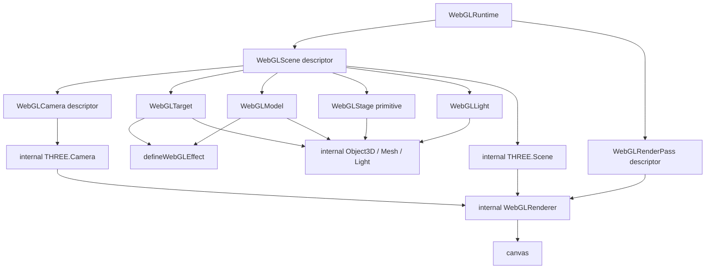
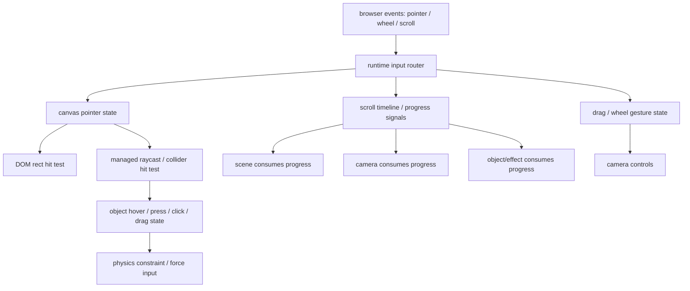

# Managed Render System Roadmap

> Strategic roadmap only. This document is not an implementation plan and should
> not be executed task-by-task. Before implementation, write a focused
> `docs/superpowers/plans/YYYY-MM-DD-<phase>.md` plan for the selected phase.

**Date:** 2026-07-03
**Baseline discussed at:** `b641a93f Tame model glow example`
**Last reviewed against:** Phase 5 target routing, scroll timelines, and effect scope implementation
**Status:** Direction-setting roadmap

## North Star

Build a DOM-first managed WebGL render system.

DOM remains the authoring anchor. Consumers declare DOM targets first. When a
page needs more structure, it can opt into managed scenes, cameras, stage
objects, lights, effects, and render passes. The runtime owns Three.js renderer,
scene, camera, raw objects, materials, textures, render targets, render loop,
resource lifetime, fallback visibility, scroll, pointer, and scheduling.

This is not a React Three Fiber clone and not a raw Three.js wrapper. The package
may borrow Three.js and R3F vocabulary where it improves authoring clarity, but
the public contract must stay descriptor-driven and runtime-managed.

## Authoring and API Guardrails

The roadmap is agent-first and consumer-first. Future APIs should be easy for an
AI agent or application author to compose correctly without needing hidden
runtime knowledge, raw Three.js ownership, or a large mental model.

React authoring should follow React's mental model:

- declarations describe desired runtime state;
- component nesting communicates ownership and inheritance where it is natural;
- props stay serializable or descriptor-like whenever possible;
- mount, update, and unmount map cleanly to runtime registration, sync, and
  disposal;
- stable identity is explicit through ids/keys, not inferred from render order;
- ordinary Level 1 usage should not require imperative refs, effects, or custom
  lifecycle wiring.

Public API shape should reduce consumer mental load:

- keep the shortest path short: `WebGLTarget` remains enough for DOM-backed
  effects;
- require scene/camera/pass vocabulary only when the consumer opts into that
  level;
- prefer defaults that match current behavior over mandatory configuration;
- make scope explicit in names and placement: target, scene, camera, pass,
  runtime, timeline, and stage-local behavior should not be ambiguous;
- reject APIs that make simple examples explain advanced rendering concepts;
- expose one clear way to do the common case before adding aliases or escape
  hatches.

Three-like vocabulary is preferred where it helps comprehension:

- use familiar names such as `position`, `rotation`, `scale`, `material`,
  `lights`, `camera`, `scene`, `animation`, and `renderPass`;
- keep the meaning close to Three.js when practical, but expose managed
  descriptors and controlled facades instead of raw instances;
- avoid inventing new terms when a Three.js term is already accurate and safe;
- do not mirror Three.js APIs mechanically if that would expose lifecycle,
  mutation, resource ownership, render-loop, or disposal responsibilities.

Implementation should follow ordinary software design discipline:

- keep modules small, cohesive, and responsible for one concern;
- keep renderer internals, React adapters, descriptor normalization, resource
  management, input, scroll, and effect scheduling decoupled;
- prefer explicit data flow over cross-module hidden state;
- introduce abstractions only after they remove real duplication or isolate a
  real ownership boundary;
- do not build a generalized render graph, plugin system, or raw escape hatch
  before concrete phases prove the need;
- every new capability needs focused tests at the descriptor/normalization and
  runtime behavior boundary that changed.

## DOM-First Boundary

The roadmap must not move the product center away from DOM-driven authoring.
Managed scene/camera/stage APIs are opt-in escalation paths for cases where the
current DOM-target model is insufficient. Each level adds vocabulary, not a new
default mental model.

```text
Level 1: DOM WebGL Target
  - default path for docs, examples, and compatibility
  - WebGLTarget is the shortest path; no user-authored scene/camera/pass needed
  - DOM owns layout, content, accessibility, fallback, and lifecycle
  - DOM rect projects into the internal generated default scene and pass
  - target-local effects act through ctx.object
  - no scene-native placement, camera controls, custom passes, or physics

Level 2: DOM-Anchored Scene
  - opt-in scene/camera vocabulary
  - WebGLTarget still owns DOM fallback/lifecycle and defaults to dom-anchored
  - objects still follow DOM rects through explicit projection policies
  - useful for overlays, layer separation, and pass/postprocess scope
  - scenes group targets and stage helpers; cameras are selected by passes

Level 3: Stage-Local 3D Island
  - advanced opt-in path
  - WebGLModel/WebGLStage descriptors can ignore DOM rect placement
  - useful for lit spaces, camera controls, physics, and real 3D interaction
  - still runtime-managed and usually attached to DOM sections/timelines/lifecycle
  - no raw Three.js ownership, even when behavior becomes scene-native
```

Design rule:

```text
Simple DOM target usage must remain the shortest and most documented path.
Scene-native APIs must not make basic DOM-to-WebGL authoring harder.
Level 3 capabilities must not leak raw Three.js ownership back into Level 1.
If a feature only helps Level 3, it must be opt-in and absent from Level 1 setup.
```

## Current Runtime Truth

- One runtime instance creates one fixed transparent canvas.
- The default runtime host creates one main internal Three `Scene`, one main
  `OrthographicCamera`, and one `WebGLRenderer`.
- `WebGLTarget` is the current DOM authoring anchor.
- Existing target sources compile into internal renderables:
  - `dom/element`: canvas-backed plane.
  - `dom/text`: text rasterized into a canvas-backed plane.
  - `media/image`: image texture plane.
  - `media/video`: video texture plane.
  - `media/image-sequence`: frame texture plane.
  - `model/glb`: loaded GLB scene wrapped in a runtime group.
- Public effect authoring is `defineWebGLEffect(...)` plus `ctx.object`.
- `ctx.object` already exposes controlled transform, material, lights,
  animation, surface, text, texture, video, model, model mesh/material, model
  point layer, material layer shader, and postprocess request capabilities.
- Raw Three.js renderer, scene, camera, object, mesh, material, texture,
  render target, pass ordering, render loop, loader, mixer, and raycaster remain
  internal.
- `ctx.runtime.postprocess` requests explicit canvas/pass-scoped bloom, blur,
  and grain. It is not target/model scoped, and the old
  `ctx.object.postprocess` object-local-looking surface has been removed.
- `example.model.float-glow` intentionally uses emissive material controls and a
  runtime-owned point light instead of canvas-scoped postprocess bloom.
- `example.model.dark-scene` is a `dom/element` surface: an unlit canvas texture
  plane, not a managed lit stage primitive.
- Current `transformScope: "subtree"` creates internal transform groups from the
  DOM target tree, but it is not a public raw scene graph.

## Product Thesis

The runtime should evolve from a set of target-local capabilities into a managed
render system while keeping DOM targets as the default authoring path:

```text
DOM target
  -> managed scene / layer
  -> managed camera / projection policy
  -> managed stage objects and lights
  -> managed effects
  -> managed render passes
  -> one or more internal Three render operations
  -> canvas
```

The public model should be:

```text
WebGLTarget     -> DOM-backed default authoring object
WebGLScene      -> optional managed scene/layer descriptor
WebGLModel      -> optional scene-native model descriptor, not a Target replacement
WebGLStage      -> optional scene-native managed primitive descriptor
WebGLCamera     -> belongs to a WebGLScene
WebGLRenderPass -> renders one WebGLScene with one WebGLCamera
Effect          -> acts on object, scene, camera, or runtime scope
```

The internal model can still use Three.js:

```text
WebGLScene descriptor     -> internal THREE.Scene or scene layer
WebGLCamera descriptor    -> internal THREE.Camera
WebGLStage primitive      -> internal THREE.Mesh / Geometry / Material
WebGLLight descriptor     -> internal THREE.Light
WebGLRenderPass descriptor-> internal render(scene, camera) and framebuffer work
```

Consumers should not receive the raw objects created by this mapping.

## Target, Scene, and Model Relationship

`WebGLTarget` remains the only default bridge from DOM to WebGL. It owns a real
DOM element, source declaration, fallback visibility, lifecycle, layout
measurement, target-local pointer state, and target-local effects. A
`WebGLTarget` may belong to a managed `WebGLScene`, but it does not require one
in user code.

`WebGLScene` is an optional grouping and projection boundary. It can provide a
camera default, pass scope, lighting environment, stage primitives, input routing
scope, and timeline bindings. It is not a public `THREE.Scene`, and it must not
turn every DOM target into scene graph authoring.

There are two model paths:

- `WebGLTarget` with `source: { kind: "model", type: "glb" }` is the DOM-first
  model path. The model is fitted from the target's DOM rect, participates in
  fallback/lifecycle behavior, and remains appropriate for content attached to
  real page structure.
- `WebGLModel` is the scene-native model path. It is opt-in, usually
  `stage-local`, and has no DOM fallback or DOM rect unless it explicitly binds
  to a DOM anchor/timeline through managed descriptors.

This separation keeps the current model source from becoming obsolete while
giving advanced scenes a cleaner way to declare pure 3D assets.

## Why This Direction

The current system has strong DOM-to-WebGL anchoring, but it lacks a public
space/stage/world concept. That leads to repeated one-off capability requests:
model glow, lit backdrop, wall/floor, target-local bloom, postprocess scope,
picking, and future physics.

The missing abstraction is not another `ctx.object.model.*` method. The missing
abstraction is a managed render model that can describe:

- which scene/layer an object belongs to;
- which camera views that scene;
- how DOM rects project into that scene;
- what stage primitives live in that scene;
- which lights affect them;
- which passes draw them to canvas;
- which postprocess effects apply to a pass or canvas.

## Public API Direction

Prefer a React component authoring layer that compiles into lower-level runtime
descriptors. The examples must show the escalation path in order: Level 1 first,
then optional scene/pass structure, then stage-local 3D.

Level 1 stays scene-free in user code:

```tsx
<WebGLRuntime>
  <WebGLTarget
    webgl={{
      key: "hero-title",
      source: { kind: "dom", type: "text" },
      effects: [{ kind: "app.titleReveal" }],
    }}
  >
    Hero Title
  </WebGLTarget>
</WebGLRuntime>
```

Level 2 adds managed scene/pass vocabulary while targets remain DOM-backed:

```tsx
<WebGLRuntime>
  <WebGLScene
    id="world"
    projection="dom-aligned"
    render={{ camera: "world.camera" }}
  >
    <WebGLCamera id="world.camera" default />

    <WebGLTarget
      webgl={{
        key: "hero-model",
        source: { kind: "model", type: "glb", src: "/models/hero.glb" },
        effects: [{ kind: "app.modelFloat" }],
      }}
    >
      <div className="hero-model-fallback" aria-label="Hero model" />
    </WebGLTarget>
  </WebGLScene>

  <WebGLScene
    id="overlay"
    projection="screen"
    render={{ camera: "screen", order: 1 }}
  >
    <WebGLCamera id="screen" default type="orthographic" mode="screen" />

    <WebGLTarget
      webgl={{
        key: "hud-title",
        source: { kind: "dom", type: "text" },
      }}
    >
      HUD Title
    </WebGLTarget>
  </WebGLScene>

</WebGLRuntime>
```

Level 3 adds scene-native stage/model descriptors only when a real 3D island is
needed:

```tsx
<WebGLRuntime>
  <WebGLScene id="world" projection="perspective-stage">
    <WebGLCamera
      id="main"
      default
      type="perspective"
      position={[0, 2, 8]}
      target={[0, 0, 0]}
    />

    <WebGLStagePlane
      id="floor"
      size={[1200, 800]}
      position={[0, -260, -80]}
      rotation={[-Math.PI / 2, 0, 0]}
      material={{
        kind: "standard",
        color: "#05070a",
        roughness: 0.8,
      }}
    />

    <WebGLLight
      id="hero-glow"
      kind="point"
      color="#7dd3fc"
      intensity={1.8}
      position={[0, 0, 160]}
    />

    <WebGLModel
      id="hero-model"
      src="/models/hero.glb"
      placement={{
        mode: "stage-local",
        position: [0, 0, 0],
      }}
      effects={[{ kind: "app.modelFloat" }]}
    />
  </WebGLScene>

  <WebGLRenderPass scene="world" camera="main" />
</WebGLRuntime>
```

Rules:

- `WebGLRuntime` auto-creates an internal generated default scene, camera, and
  pass for Level 1 usage. The internal generated ids are reserved, but consumer
  ids such as `main` are ordinary managed ids.
- `WebGLTarget` inherits the nearest `WebGLScene` by React context.
- `WebGLScene` owns a default camera.
- `WebGLTarget` belongs to a scene, not directly to a camera.
- In React, `WebGLScene render` is the primary way to say this scene
  participates in rendering. `WebGLRenderPass` remains an advanced explicit
  pass descriptor.
- The runtime may auto-create a pass only for the internal generated default
  scene.
- Additional scenes require `WebGLScene render`, an explicit
  `WebGLRenderPass`, or an explicit `defaultPass` declaration.
- Non-React consumers use equivalent descriptors with explicit `sceneId`,
  `cameraId`, and `pass` fields.
- `WebGLTarget` remains DOM-backed and owns fallback/lifecycle behavior.
- Scene-native descriptors such as `WebGLModel`, `WebGLStagePlane`, and
  `WebGLLight` do not require DOM anchors or fallback DOM.
- `WebGLModel` should be used only when a model is authored as scene-native. A
  model that should follow DOM layout should stay a `WebGLTarget` model source.

## Concept Relationships



## Scope Model

The effect context should eventually make scope explicit:

```text
ctx.object  -> current target/renderable object facade
ctx.scene   -> managed scene/layer metadata and future scoped controls
ctx.camera  -> future explicit camera/pass-bound controller context, never implicit
ctx.runtime -> runtime/canvas scoped metadata and controls
```

This does not mean all scopes need to ship at once. It means new capabilities
should be placed according to their real ownership:

- target transform, material, texture, text, model modules: `ctx.object`;
- scene metadata, timeline state, lighting/environment/stage coordination:
  `ctx.scene`;
- camera progress/motion/focus/framing: Phase 6A camera-scoped descriptors or
  `ctx.camera` only when bound to a specific camera/pass context;
- render pass and canvas-wide postprocess: `ctx.runtime` or pass-scoped API.

Target-local effects should not assume an implicit "current camera" in
multi-camera or multi-pass scenes. Camera mutation should be authored on camera
descriptors/controllers, or through an explicit named camera binding.

## Input and Interaction Ownership

Browser events belong to the runtime boundary, not to individual Three objects.
Three.js `Object3D` instances do not receive DOM pointer or scroll events by
themselves. The runtime should capture input once, normalize it, route it, and
then let managed scene/camera/object/physics consumers opt in.



Design rule:

```text
Capture input once at runtime/canvas/scroll-provider scope.
Route input through managed hit tests and priority rules.
Let scenes, cameras, targets, stage objects, and physics bodies consume signals.
Do not let user code attach raw DOM listeners to internal Three objects.
```

Consumption scopes:

- `ctx.runtime`: canvas-level pointer state, scroll adapters, scroll timelines,
  input capture, and global routing diagnostics.
- `ctx.scene`: scene-local pointer coordinates, scene hover/active state, and
  scene-wide progress-driven controllers.
- `ctx.camera`: Phase 6A progress-driven focus/framing/motion and Phase 8
  pointer-driven parallax, dolly, orbit/trackball-style managed controllers.
- `ctx.object`: target/object hover, press, click, drag, local pointer state, and
  object-local progress.
- future physics scope: drag constraints, forces, impulses, collision events,
  and body transforms.

Routing priority should be explicit:

```text
active pointer capture
  -> active physics/object drag constraint
  -> newly hit pickable object
  -> scene/camera empty-space controls
  -> passive pointer/progress effects
```

Examples:

- Whole-scene pointer parallax usually belongs to `ctx.camera` when it means
  "move the viewer" and to `ctx.scene` when it means "move a managed layer".
- Dragging empty space to rotate the view is a managed camera controller.
- Dragging a model to rotate it is an object controller.
- Dragging a 3D body with realistic inertia is a physics constraint built on top
  of managed hit testing and collider descriptors.

Compatibility with the current runtime:

- Existing `ctx.pointer` remains runtime/canvas pointer state.
- Existing `ctx.targetPointer` remains DOM-target-local pointer state.
- Existing pointer declarations (`hover`, `press`, `click`, `drag`) remain
  target-scoped and DOM-rect based.
- Future 3D picking should add scene/object hit state beside this model, not
  replace current DOM-first pointer behavior.

## DOM Rect Projection Contract

DOM rect mapping remains a core differentiator. Multiple scenes and cameras do
not remove DOM anchoring. They require explicit projection policies.

Separate two ideas:

- **Projection policy**: how a scene/camera maps coordinates.
- **Placement mode**: where an object gets its position from.

Projection policies:

### `dom-aligned`

Default current behavior.

```text
DOM rect center -> orthographic scene position
DOM rect size   -> plane/model fit extent
```

Use for the internal generated default scene, text, DOM surfaces, media planes,
and existing examples.

### `screen`

Screen-space overlay behavior.

```text
DOM rect -> overlay orthographic coordinates
render pass -> after world/main pass, usually with clearDepth
```

Use for HUD, labels, markers, annotations, and screen UI.

### `perspective-stage`

3D world behavior.

Possible placement modes:

```text
screen-depth: DOM rect projects to a fixed camera depth
screen-plane: DOM rect center casts a ray to a named plane
screen-billboard: target becomes a camera-facing plane at a chosen depth/plane
stage-local: descriptor uses explicit world/stage coordinates
```

Use for models or stage objects that must participate in a real 3D space.

## Placement Modes

Placement modes answer: "what owns this object's position?"

### `dom-anchored`

The object is anchored to a real DOM element.

```text
DOM getBoundingClientRect()
  -> scene/camera projection policy
  -> object position and size
```

Use for DOM text, DOM element surfaces, image/video targets, DOM-driven cards,
and models that should follow a page section or element.

Example direction:

```tsx
<WebGLTarget
  webgl={{
    key: "hero-title",
    source: { kind: "dom", type: "text" },
    placement: { mode: "dom-anchored" },
  }}
>
  Hero Title
</WebGLTarget>
```

This is the default for `WebGLTarget` because it preserves the current
DOM-to-WebGL contract.

### `screen-anchored`

The object is anchored to the canvas/screen, not a DOM element.

```text
screen anchor / pixel offset
  -> screen orthographic scene coordinates
  -> object position
```

Use for HUD, fixed labels, reticles, minimap frames, screen annotations, and
overlay UI that should not move with document layout.

Example direction:

```tsx
<WebGLLabel
  id="fps"
  placement={{
    mode: "screen-anchored",
    anchor: "top-right",
    offset: [-24, 24],
  }}
/>
```

### `stage-local`

The object is placed directly in the managed scene's own coordinate system.

```text
position / rotation / scale descriptor
  -> world/stage local coordinates
  -> object transform
```

Use for pure 3D scene objects that may have no DOM counterpart: floors, walls,
backdrops, lights, decorative objects, physics bodies, particles, and models in
a fully scene-native world.

Example direction:

```tsx
<WebGLModel
  id="robot"
  src="/models/robot.glb"
  placement={{
    mode: "stage-local",
    position: [0, 0, 0],
    rotation: [0, Math.PI, 0],
    scale: 1.2,
  }}
/>
```

This is the bridge from DOM-first runtime to managed 3D scenes. It allows one
scene to use scene-local 3D placement while still using runtime-owned descriptors
and lifecycle.

## Render Pass Contract

Render passes should be limited in v1. Do not expose arbitrary render targets or
composer pass objects in the default API.

Initial pass fields:

```ts
type WebGLRenderPassDeclaration = {
  id?: string;
  scene: string;
  camera?: string;
  order?: number;
  clear?: boolean;
  clearDepth?: boolean;
  viewport?: {
    mode?: "canvas" | "dom-rect";
    anchor?: string;
    x?: number | string;
    y?: number | string;
    width?: number | string;
    height?: number | string;
    scissor?: boolean;
  };
  postprocess?: WebGLPostprocessDeclaration;
};
```

Default pass behavior:

- Single scene/camera apps get one generated pass on one runtime canvas.
- Only the internal generated default scene receives an implicit generated pass.
- Additional scenes must opt into rendering with `WebGLScene render`,
  `WebGLRenderPass`, or `defaultPass`.
- Additional cameras do not render anything by themselves. A camera becomes
  visible only through a render pass.
- Multiple scenes/cameras/passes compose into the same canvas by default. They do
  not imply multiple runtime instances, multiple canvases, or consumer-owned
  render loops.
- Overlay passes default to `clearDepth: true`.
- Minimap or picture-in-picture passes use explicit `viewport`/scissor.
- DOM-bound local scene passes use runtime-measured DOM rects plus scissor; they
  are not CSS `overflow` clipping and they do not create additional canvases.
  This is the missing capability for a pinned section whose managed stage scene
  animates inside a DOM region and then scrolls away with that region.
- Postprocess is pass/canvas scoped, not object scoped.
- Arbitrary render graphs, custom framebuffers, composer plugin chains, and raw
  pass objects stay out of the default API.

## Default vs Opt-In

Keep these default and simple:

- one `WebGLRuntime` creates one managed transparent canvas;
- Level 1 authoring uses `WebGLTarget` without user-authored scene/camera/pass;
- internal generated default scene, DOM-aligned orthographic camera, and
  generated pass preserve current behavior;
- `WebGLTarget` placement defaults to `dom-anchored`;
- native/browser scroll remains enough for ordinary pages;
- target pointer behavior remains DOM-rect based through `ctx.pointer` and
  `ctx.targetPointer`;
- effects default to target-local `ctx.object` capabilities;
- fallback visibility, resource lifetime, scheduling, and disposal stay
  runtime-owned.

Make these explicit opt-in capabilities:

- user-declared `WebGLScene`, `WebGLCamera`, and `WebGLRenderPass`;
- additional scenes, additional cameras, overlay passes, minimap/viewport passes,
  and pass-scoped postprocess;
- `perspective-stage` projection and `stage-local` placement;
- scene-native `WebGLModel`, stage primitives, lights, and materialized floors,
  walls, or backdrops;
- managed scroll timelines beyond basic progress keys;
- camera controls, scene-level input routing, raycast/picking, colliders, and
  physics;
- declarative model clip defaults, crossfade, morph controls, and bone
  attachment points;
- any unsafe/unstable raw Three.js escape hatch, if it is ever accepted.

Do not promote an opt-in capability to default unless it improves Level 1
DOM-target usage without adding required concepts to existing consumers.

## Roadmap Status

Status values:

```text
[not-started]  Direction exists, but no focused implementation plan exists.
[planned]      A focused plan exists under docs/superpowers/plans/.
[in-progress]  Tests or implementation are underway.
[implemented]  Code is written, but verification/docs/commit may not be closed.
[verified]     Tests, docs, and commit are closed for that phase.
[blocked]      The phase has a concrete blocker.
[superseded]   A later design replaced this phase.
```

| Phase | Status | Focused Plan | Notes |
| --- | --- | --- | --- |
| Phase 0: Direction and Boundary Alignment | `[verified]` | n/a | Roadmap created, docs reorganized, DOM-first Level 1/2/3 boundary documented. |
| Phase 1: Internal Render Layer Foundations | `[verified]` | [2026-07-03-internal-render-layer-foundations.md](../superpowers/plans/2026-07-03-internal-render-layer-foundations.md) | Internal generated scene/camera/pass foundation is implemented and verified; public API remains unchanged. |
| Phase 2: Opt-In Scene, Camera, and Pass Declarations | `[verified]` | [2026-07-03-opt-in-scene-camera-pass-declarations.md](../superpowers/plans/2026-07-03-opt-in-scene-camera-pass-declarations.md) | Public declarations, runtime descriptor parity, target scene inheritance, and Level 1 compatibility are verified. |
| Phase 3: Projection Policies | `[verified]` | [2026-07-03-projection-policies.md](../superpowers/plans/2026-07-03-projection-policies.md) | Projection and placement policies are implemented and verified; Phase 4 can start from explicit stage contracts. |
| Phase 4: Managed Stage Primitives | `[verified]` | [2026-07-04-managed-stage-primitives.md](../superpowers/plans/2026-07-04-managed-stage-primitives.md) | Public stage primitive/light descriptors, runtime wiring, tests, docs, and commit are closed; `screen-plane` remains a Phase 8 pre-step. |
| Phase 5: Target Routing, Scroll Timelines, and Effect Scope | `[verified]` | [2026-07-04-target-routing-scroll-timelines-effect-scope.md](../superpowers/plans/2026-07-04-target-routing-scroll-timelines-effect-scope.md) | Timeline bindings, `WebGLScrollTimeline`, target/scene/stage/light activation, scoped effect metadata, tests, docs, and commit are closed; camera timeline control remains future explicit controller work. |
| Phase 6: Pass Viewport And Postprocess Scope Correction | `[verified]` | [2026-07-04-pass-viewport-postprocess-scope.md](../superpowers/plans/2026-07-04-pass-viewport-postprocess-scope.md) | DOM-bound pass viewport/scissor, pass descriptors, runtime/pass postprocess scope, debug summaries, tests, docs, and commit are closed; no camera behavior ships here. |
| Phase 6A: Managed Camera Controllers | `[not-started]` | none | Owns progress-driven camera motion/focus/framing, explicit camera/pass-bound controller API, and the decision on any future `WebGLCameraDeclaration.timeline`; pointer-driven camera interaction remains Phase 8. |
| Phase 7: Managed Model Animation | `[not-started]` | none | Can start after Phase 5; advanced morph/bone work may depend on Phase 8/9. |
| Phase 8: Interaction and Picking | `[not-started]` | none | Depends on stable scene/camera/projection/stage contracts. |
| Phase 9: Dynamics and Physics | `[not-started]` | none | Depends on Phase 8 hit state and collider model. |
| Phase 10: Advanced Escape Hatch Decision | `[not-started]` | none | Decide only after managed descriptors prove insufficient. |

Rules for future updates:

- Every implementation loop must start by reading this table.
- When a focused plan is created, update the phase to `[planned]` and link it.
- When tests or code begin, update the phase to `[in-progress]`.
- When implementation is complete but not fully verified, use `[implemented]`.
- Only use `[verified]` after tests, docs, and commit are closed.
- Do not infer status from memory or archived plans; update this table as the
  source of truth.

## Roadmap

Phase dependency order:

```text
Phase 1 -> internal scene/camera/pass registries
Phase 2 -> opt-in declarations that keep Level 1 unchanged
Phase 3 -> projection and placement policies
Phase 4 -> managed stage substrate for lit scene-native objects
Phase 5 -> target routing, scroll timelines, and effect scopes
Phase 6 -> pass viewport/scissor plus runtime/pass postprocess scope correction
Phase 6A -> progress-driven managed camera controllers
Phase 7 -> managed model animation
Phase 8 -> input routing and picking
Phase 9 -> dynamics and physics
Phase 10 -> unsafe escape hatch decision, only if still needed
```

Ordering rules:

- Scroll timelines must exist before camera motion, progress-driven model
  animation, and timeline-driven scene/stage controllers depend on them.
- Progress-driven camera motion, focus, framing, any future
  `WebGLCameraDeclaration.timeline`, and explicit camera/pass-bound controller
  descriptors belong to Phase 6A after Phase 5 timeline ownership and Phase 6
  pass scope are stable.
- Pointer-driven camera interaction such as parallax, orbit, pan, and empty-space
  drag remains Phase 8 work because it depends on input routing and
  object-vs-camera priority.
- DOM-bound pass viewport/scissor depends on Phase 5 scope/timeline ownership:
  Phase 5 decides when a pinned scene/pass is active, and Phase 6 decides where
  that pass is clipped on the canvas.
- Input routing and picking require stable scene/camera/projection/stage
  contracts. They should happen before physics, but they do not need to block
  basic model clip animation.
- Model animation can ship before 3D picking because clip playback, clip
  scrubbing, crossfade, and morph controls are runtime/model concerns.
- Physics waits until managed stage objects, colliders, input routing, and
  lifecycle/disposal semantics are stable.

### Phase 0: Direction and Boundary Alignment

- **Status:** `[verified]`
- **Focused plan:** n/a
- **Depends on:** roadmap discussion
- **Last updated:** 2026-07-03
- **Exit criteria:** roadmap exists, DOM-first boundary is documented, completed
  plans are archived, active docs point to this roadmap.

Goal: make the final model clear before implementation.

Deliverables:

- Add this roadmap.
- Update high-level docs later to point to the selected roadmap once approved.
- Define terminology:
  - `WebGLScene` is managed scene/layer, not raw `THREE.Scene`.
  - `WebGLCamera` is managed camera descriptor, not raw `THREE.Camera`.
  - `WebGLScene render` is the primary React render declaration.
  - `WebGLRenderPass` controls render order and composition for explicit pass
    descriptors.
  - `WebGLTarget` remains the DOM anchor.
- Confirm non-goals:
  - no default raw Three.js object exposure;
  - no R3F internal rewrite;
  - no arbitrary composer/pass graph in v1;
  - no physics before stable stage/collider semantics.

Validation:

- Docs describe current truth and future direction separately.
- No code behavior changes.
- `git diff --check` is enough for this docs-only phase.

### Phase 1: Internal Render Layer Foundations

- **Status:** `[verified]`
- **Focused plan:** [2026-07-03-internal-render-layer-foundations.md](../superpowers/plans/2026-07-03-internal-render-layer-foundations.md)
- **Depends on:** Phase 0
- **Last updated:** 2026-07-03
- **Exit criteria:** internal scene/camera/pass registries exist with one
  internal generated scene, one internal generated camera, and one internal
  generated pass;
  public API and Level 1 `WebGLTarget` behavior are unchanged.

Goal: refactor internal state to make scene/camera/pass concepts explicit while
preserving current behavior.

Current behavior should compile to:

```text
scene: main
camera: main
pass: render(main, main)
```

Implementation direction:

- Introduce internal scene registry with one generated default entry.
- Introduce internal camera registry with one default DOM-aligned orthographic
  camera.
- Introduce internal pass list with one generated pass.
- Keep existing `createThreeRendererHost` behavior as the default host.
- Preserve existing target registration, layout measurement, fallback,
  lifecycle, scroll, pointer, and effect scheduling semantics.

Acceptance criteria:

- All current tests pass.
- Existing public API is unchanged.
- Debug state can still describe current target counts and renderable counts.
- No consumer-visible multi-scene feature is required yet.

### Phase 2: Opt-In Scene, Camera, and Pass Declarations

- **Status:** `[verified]`
- **Focused plan:** [2026-07-03-opt-in-scene-camera-pass-declarations.md](../superpowers/plans/2026-07-03-opt-in-scene-camera-pass-declarations.md)
- **Depends on:** Phase 1
- **Last updated:** 2026-07-03
- **Exit criteria:** managed React declarations can opt into scene/camera/pass
  ownership without requiring Level 1 users to author scenes, cameras, or
  passes.

Goal: add managed React declarations without exposing raw Three.js objects or
making Level 1 users author scenes, cameras, or passes.

Public direction:

```tsx
<WebGLRuntime>
  <WebGLTarget webgl={{ key: "title", source: titleSource }}>
    Title
  </WebGLTarget>

  <WebGLScene id="world" render={{ camera: "world.camera" }}>
    <WebGLCamera id="world.camera" default type="orthographic" mode="dom-aligned" />
    <WebGLTarget webgl={{ key: "model", source }}>
      <div className="model-fallback" />
    </WebGLTarget>
  </WebGLScene>
</WebGLRuntime>
```

Rules:

- `WebGLTarget` inherits nearest `WebGLScene`.
- `WebGLTarget` outside any `WebGLScene` remains valid and uses the internal
  generated Level 1 default scene.
- Unregistering a managed scene releases live targets still routed to that
  scene.
- `WebGLScene` can declare a default camera.
- `WebGLScene render` picks the scene camera for React-owned rendering.
  `WebGLRenderPass` remains available for explicit pass descriptors.
- Managed scenes do not render unless explicitly passed or declared with
  `render`/`defaultPass`.
- Runtime descriptor API should support the same model without React context.
- Phase 2 supports only DOM-aligned scenes and orthographic DOM-aligned cameras;
  projection policies, screen overlays, perspective stages, stage-local
  placement, and multiple camera projection policies belong to later phases.

Acceptance criteria:

- Current examples can run unchanged.
- New tests prove target scene inheritance.
- New tests prove duplicate scene/camera ids produce controlled diagnostics.
- Public contract tests reject raw `THREE.Scene` and `THREE.Camera` handles.

Completion notes:

- React exports `WebGLScene`, `WebGLCamera`, and `WebGLRenderPass`.
- Vanilla runtimes can register equivalent scene, camera, and pass descriptors.
- `WebGLTarget` inherits nearest React scene context when `webgl.sceneId` is
  absent; explicit `sceneId` gives vanilla parity.
- Targets outside managed scenes still render through the internal generated
  default scene.
- Managed DOM-aligned scene cameras resize with the runtime viewport, and
  subtree transform groups stay inside their target scene adapter.
- Scene-owned render declarations wait until the referenced/default camera is
  registered.
- Phase 2 keeps projection scope narrow: `dom-aligned` scenes and
  orthographic/dom-aligned cameras only. Projection policies remain Phase 3.

### Phase 3: Projection Policies

- **Status:** `[verified]`
- **Focused plan:** [2026-07-03-projection-policies.md](../superpowers/plans/2026-07-03-projection-policies.md)
- **Depends on:** Phase 1, Phase 2
- **Last updated:** 2026-07-04
- **Exit criteria:** projection policies and placement modes are explicit,
  testable, and preserve current DOM rect behavior for Level 1.

Goal: formalize how DOM rects map into each managed scene/camera type.

Deliverables:

- `dom-aligned` policy for current behavior.
- `screen` policy for overlay scenes.
- `perspective-stage` policy design and at least one initial placement mode.
- Placement modes:
  - `dom-anchored` for existing DOM-driven targets;
  - `screen-anchored` for overlay/HUD objects;
  - `screen-depth` as the first perspective-stage DOM bridge;
  - `stage-local` for explicit scene-local target layout.
- Render pass descriptors support runtime-owned `clear` and `clearDepth`.
- Debug records report projection policy, placement mode, and scene id for each
  target.

Resolved v1 decision:

- `screen-depth` ships as the first perspective-stage DOM bridge.
- `screen-plane` remains deferred to the Phase 8 pre-step for placement against
  named stage planes.

Acceptance criteria:

- DOM-aligned scenes preserve existing rect-to-plane behavior.
- Overlay scenes render screen-space content without world depth interference.
- Perspective stage mapping has explicit, testable math.
- Existing Level 1 targets continue to use the generated DOM-aligned
  scene/camera/pass.

### Phase 4: Managed Stage Primitives

- **Status:** `[verified]`
- **Focused plan:** [2026-07-04-managed-stage-primitives.md](../superpowers/plans/2026-07-04-managed-stage-primitives.md)
- **Depends on:** Phase 3
- **Last updated:** 2026-07-04
- **Exit criteria:** runtime-owned lit stage primitives can coexist with GLB
  models without exposing raw meshes, materials, or lights; Phase 3's deferred
  `screen-plane` placement decision is explicitly resolved or recorded as a
  follow-up.

Goal: introduce real lit scene substrate.

Public direction:

```tsx
<WebGLScene id="world">
  <WebGLCamera id="main" default type="perspective" />

  <WebGLStagePlane
    id="floor"
    role="floor"
    size={[1200, 800]}
    material={{ kind: "standard", color: "#05070a", roughness: 0.8 }}
  />

  <WebGLStagePlane
    id="backdrop"
    role="backdrop"
    material={{ kind: "standard", color: "#020617" }}
  />

  <WebGLLight id="ambient" kind="ambient" intensity={0.2} />
  <WebGLLight id="hero" kind="point" intensity={1.8} position={[0, 0, 160]} />
</WebGLScene>
```

Initial primitive set:

- `plane`;
- `box`;
- role aliases: `floor`, `wall`, `backdrop`;
- material descriptors: `basic`, `standard`;
- light descriptors: `ambient`, `directional`, `point`.

Focused plan reminders:

- Start with concrete React components such as `WebGLStagePlane` and
  `WebGLStageBox`. Do not add a generic `<WebGLStage kind="...">` wrapper until
  more primitive kinds prove that abstraction useful.
- Initial stage materials are solid-color descriptor data. Do not add
  `material.map`, texture URL, image texture, normal map, or roughness map
  descriptors in Phase 4 unless the focused plan explicitly expands scope to
  runtime-owned stage texture loading, caching, error handling, and disposal.
- Scene-native `WebGLModel` is not part of Phase 4. Phase 4 only needs lit stage
  primitives to coexist with existing GLB model targets.

Phase 3 deferred `screen-plane` follow-up:

- If Phase 4 introduces named stage planes, the focused Phase 4 plan must
  explicitly decide whether to add `placement: { mode: "screen-plane", planeId }`
  in the same phase.
- If `screen-plane` would expand Phase 4 beyond the managed stage primitive
  substrate, the Phase 4 plan must record it as an explicit follow-up tied to
  named stage planes. Do not leave it as an implicit open question.
- Focused plan decision: Phase 4 does not implement `screen-plane`; the exact
  owner is a Phase 8 pre-step for screen-plane placement against named stage
  planes before interactive picking state is exposed.

Rules:

- Stage primitives are internal meshes, not raw `THREE.Mesh`.
- Materials are descriptors or managed facades, not raw `THREE.Material`.
- Lights are keyed runtime-owned objects.
- Stage objects participate in the scene's lighting and depth.
- `screen-plane`, when accepted, remains a managed placement descriptor that
  targets a named runtime-owned plane; it must not expose raw planes, raycasters,
  intersections, meshes, or camera internals.

Acceptance criteria:

- A point light can visibly affect a floor/backdrop with standard material.
- Existing `dom/element` surfaces remain unlit unless explicitly materialized as
  stage primitives.
- Runtime owns disposal for geometry, material, texture, light, and generated
  objects.
- If Phase 4 keeps stage materials solid-color only, it should explicitly record
  that no new stage textures are created; the future stage texture descriptor
  plan owns any new texture loading and disposal contract.
- The Phase 4 focused plan either implements `screen-plane` against named stage
  planes or documents the exact later phase/follow-up that will own it.

### Phase 5: Target Routing, Scroll Timelines, and Effect Scope

- **Status:** `[verified]`
- **Focused plan:** [2026-07-04-target-routing-scroll-timelines-effect-scope.md](../superpowers/plans/2026-07-04-target-routing-scroll-timelines-effect-scope.md)
- **Depends on:** Phase 2, Phase 3, Phase 4
- **Last updated:** 2026-07-04
- **Exit criteria:** target, scene, runtime, and timeline scopes are explicit;
  camera timeline/control ownership is documented for later explicit
  controller work; current `ScrollEffectSection` usage remains compatible.

Goal: make target, scene, runtime, and timeline scopes explicit while recording
camera timeline/control ownership as Phase 6A explicit camera-controller work.

Deliverables:

- `WebGLTarget` routing by component context and descriptor fallback.
- `WebGLScrollTimeline` direction as a managed progress signal for targets,
  scenes, model animation, and stage objects.
  Phase 6A camera controllers should reuse the same named timeline signal, but
  Phase 5 must not add `timeline` to `WebGLCameraDeclaration`.
- Scope-specific effect context exploration:
  - `ctx.scene` for managed scene controls;
  - `ctx.runtime` for canvas/pass scoped controls.
  `ctx.camera` remains Phase 6A explicit camera/pass-bound controller work.
- Keep `ScrollEffectSection` as compatibility sugar for target/effect pinned
  sections while the broader timeline abstraction is designed.
- Keep `ctx.object` focused on the current target/renderable.
- Pinned managed stage examples should only control scene/pass/stage
  visibility, timeline progress, and scoped controller state in Phase 5. They
  should not pretend that a `WebGLScene` nested under a DOM element is locally
  clipped; DOM-bound pass viewport/scissor belongs to Phase 6.

Completion notes:

- Public `timeline` bindings exist on `WebGLTarget`, `WebGLScene`,
  `WebGLStagePlane`, `WebGLStageBox`, and `WebGLLight`.
- `WebGLCameraDeclaration` intentionally does not have `timeline`; camera
  motion/focus/framing will consume named timeline signals only through a Phase
  6A explicit camera/pass-bound controller.
- `WebGLScrollTimeline` is the broader React scroll timeline component.
  `ScrollEffectSection` remains compatibility sugar for target/effect pinned
  sections.
- Target renderables, scene render passes, and stage primitive/light
  controllers can consume active timeline ranges without React descriptor churn.
  Active ranges compose with effect/declaration visibility instead of forcing
  hidden objects visible.
- Effect contexts expose `ctx.runtime.progress` and optional `ctx.scene`
  descriptor/timeline metadata. They do not expose raw scenes, cameras, passes,
  renderers, or `ctx.camera`.
- Phase 4 debug inventory shape is preserved and extended only with
  descriptor-only timeline summaries for stage primitives and lights.

Rules:

- Do not keep adding renderer-level capabilities under `ctx.object`.
- Do not make targets choose cameras by default.
- Camera is selected by render pass, not object ownership.
- Scroll libraries may provide progress signals, but they must not own the
  renderer, scene, camera, render loop, or internal objects.
- Timeline progress is consumed by managed effects/controllers; it does not
  expose raw GSAP timelines as the runtime contract.
- Target-local effects do not receive an implicit active camera in multi-pass
  scenes.
- Phase 6A camera effects/controllers must bind to an explicit camera descriptor
  or pass context.
- `WebGLCameraDeclaration` does not receive a `timeline` field in Phase 5.

Acceptance criteria:

- Existing target-local effects keep working.
- Existing `ScrollEffectSection` usage keeps working.
- A scene, target, stage primitive/light, image sequence, or later model
  animation can consume the same named timeline/progress signal through managed
  runtime state.
- Future camera controllers have documented ownership for reusing the same
  named timeline signal, but camera declarations remain behavior-free in
  Phase 5.
- Pinned scene/stage visibility can be driven by managed timeline scope without
  React descriptor churn.
- New scene scope metadata is clearly scoped and documented.
- Public tests reject raw scene/camera access.

### Phase 6: Pass Viewport And Postprocess Scope Correction

- **Status:** `[verified]`
- **Focused plan:** [2026-07-04-pass-viewport-postprocess-scope.md](../superpowers/plans/2026-07-04-pass-viewport-postprocess-scope.md)
- **Depends on:** Phase 5
- **Last updated:** 2026-07-04
- **Exit criteria:** DOM-bound pass viewport/scissor works without additional
  canvases or raw renderer access; postprocess has pass/runtime-scoped public
  naming; examples no longer read as object-local unless explicitly marked as
  legacy compatibility.

Goal: make render-pass scope concrete: where a pass draws, when it composes, and
which pass/canvas owns postprocess.

Local DOM viewport/scissor direction:

- A managed stage scene that appears inside a pinned DOM section needs a
  runtime-owned pass viewport bound to that section's measured DOM rect.
- The DOM element provides the rectangle; the WebGL pass uses renderer-owned
  viewport/scissor state. CSS `overflow`, DOM opacity, or wrapper layout must
  not be treated as WebGL clipping.
- This is distinct from Phase 8 `screen-plane`: viewport/scissor clips where a
  pass is visible; `screen-plane` maps DOM or pointer coordinates onto a named
  stage plane.
- Phase 5 decides the active scene/pass/timeline scope for pinned sections.
  Phase 6 should make the active pass render only inside the owned DOM rect and
  then scroll away with that rect.
- The focused plan should choose the smallest declarative API, such as a
  DOM-bound `viewport` descriptor or a React owner component, without exposing
  raw renderer viewport/scissor calls.

Postprocess scope issue:

Previous issue:

The old object-level postprocess facade looked target-local, but it affected
the runtime canvas. Phase 6 removes that public object facade.

Target direction:

```ts
ctx.runtime.postprocess.request({
  key: "scene.cinematic",
  scope: { passId: "world.pass" },
  grain: { amount: 0.04 },
});
```

or descriptor-level:

```tsx
<WebGLRenderPass
  scene="world"
  postprocess={{
    grain: { amount: 0.04 },
    bloom: { strength: 0.35 },
  }}
/>
```

Migration:

- `ctx.object.postprocess` is removed from the public object facade because the
  old name read as object-local.
- Effect-authored postprocess uses `ctx.runtime.postprocess.request(...)` with
  explicit `{ canvas: true }` or `{ passId }` scope. Descriptor-level pass
  postprocess remains on `WebGLRenderPass` / `WebGLScene render`.

Acceptance criteria:

- A pass can render into a runtime-measured DOM rect with scissor enabled, so a
  pinned managed stage example can animate inside its section instead of the full
  canvas.
- Model-local glow examples use material/emissive/lights, not canvas bloom.
- Canvas/pass postprocess examples explicitly communicate whole-pass scope.
- Debug state reports active postprocess requests by pass/canvas scope.

### Phase 6A: Managed Camera Controllers

- **Status:** `[not-started]`
- **Focused plan:** none
- **Depends on:** Phase 5, Phase 6
- **Last updated:** 2026-07-04
- **Exit criteria:** progress-driven camera motion/focus/framing can be declared
  through managed camera/pass-bound APIs without exposing raw cameras,
  controls, matrices, render loop hooks, or target-local implicit camera scope.

Goal: add explicit managed camera behavior for scenes that need timeline-driven
framing while keeping Level 1 `WebGLTarget` usage camera-free.

Deliverables:

- A focused API decision between a separate camera-controller descriptor and any
  future `WebGLCameraDeclaration.timeline` field.
- Progress-driven camera motion, focus, and framing that consume named timeline
  signals created by Phase 5.
- Camera/pass-bound effect or controller context that can address one declared
  camera or pass without creating target-local implicit `ctx.camera`.
- Public type and runtime tests proving raw Three.js `Camera`, controls, matrix,
  and render loop handles are not exposed.
- Documentation explaining that camera behavior is explicit scene/pass work, not
  target ownership.

Rules:

- Prefer an explicit controller descriptor over adding behavior directly to the
  static camera declaration unless the focused plan proves the declaration field
  is clearer.
- If `WebGLCameraDeclaration.timeline` is added later, it belongs to this phase
  and must have concrete motion/focus/framing semantics.
- Do not add pointer-driven orbit, pan, drag, or pointer parallax here; those
  remain Phase 8 input-routing work.
- Do not expose raw Three.js cameras, `OrbitControls`, matrices, projection
  mutation, or render-loop callbacks.

### Phase 7: Managed Model Animation

- **Status:** `[not-started]`
- **Focused plan:** none
- **Depends on:** Phase 5
- **Last updated:** 2026-07-04
- **Exit criteria:** complete animated GLB assets can play, scrub, blend, and
  expose morph controls through managed runtime APIs without exposing raw
  mixers, actions, bones, skeletons, or morph arrays.

Goal: turn complete animated GLB assets into managed runtime-driven behavior
without exposing raw `AnimationMixer`, `AnimationAction`, `Bone`, `Skeleton`, or
morph target arrays.

Current baseline:

- The runtime already supports basic model clip playback through
  `ctx.object.animation`.
- The runtime creates and owns the `AnimationMixer` for GLB `animations`.
- Effects can list clips, play clips, stop clips, stop all clips, and set mixer
  time.
- Mixers update through runtime scheduling and stop updating when the model is
  not visible.

Model asset requirements:

- Whole-model transform animation requires no special GLB data.
- Clip playback requires exported GLTF/GLB `animations` with stable clip names.
- Skeletal animation requires `SkinnedMesh`, bones, skeleton, and skin weights.
- Morph animation requires morph target attributes and stable morph target names
  or indices.
- Bone-level controls and attachments require stable exported bone names.
- Physics-driven movement requires colliders and belongs to Phase 9, not this
  phase.

Capabilities:

- Declarative clip defaults on model descriptors:
  - clip name;
  - loop mode;
  - time scale;
  - fade in/out;
  - clamp when finished.
- Progress-driven clip scrubbing from scroll timelines or effect progress.
- Clip blending and crossfade between named actions.
- Additive animation layer descriptors for breathing, idle overlays, or small
  secondary motion.
- Managed morph target facade:
  - list targets;
  - set target weight by name;
  - animate target weights from progress or time.
- Managed rig metadata:
  - list named clips, morph targets, and optionally named bones;
  - expose capability diagnostics for missing clips/morphs/bones.
- Optional managed attachment points for named bones without exposing raw
  `Bone` objects.

Public direction:

```tsx
<WebGLModel
  id="character"
  src="/models/character.glb"
  placement="stage-local"
  animation={{
    defaultClip: "Idle",
    loop: "repeat",
    transitions: [{ from: "Idle", to: "Walk", fadeMs: 240 }],
  }}
/>
```

Focused plan reminder:

- Phase 7 owns the scene-native `WebGLModel` descriptor path. Start the focused
  plan by deciding the minimal `WebGLModel` descriptor shell and how it reuses
  runtime-owned model loading/lifecycle before layering clip defaults, scrubbing,
  crossfade, morph controls, and rig diagnostics.
- Keep DOM-backed model targets valid. `WebGLModel` is opt-in for scene-native
  `stage-local` models, not a replacement for `WebGLTarget` model sources.

Future effect direction:

```ts
defineWebGLEffect({
  kind: "app.characterScroll",
  update(ctx, _state, params) {
    const progress = ctx.progress.get(params.progressKey);
    ctx.object.animation?.play("Walk", { loop: "repeat" });
    ctx.object.animation?.setTime(progress * 1.4);
    ctx.object.model?.morphs?.set("Smile", progress);
  },
});
```

Rules:

- Keep raw Three animation internals private.
- Do not expose direct `AnimationMixer`, `AnimationAction`, `Bone`, `Skeleton`,
  or `morphTargetInfluences`.
- Do not promise procedural character animation for static, unrigged models.
- Do not couple clip playback to React or GSAP; playback is runtime-owned.
- Treat missing clip/morph/bone names as controlled diagnostics, not crashes.

Acceptance criteria:

- A complete animated GLB can declare and play a default clip without custom
  effect code.
- An effect can scrub a named clip from a timeline/progress signal.
- Two clips can crossfade through managed options.
- A named morph target can be driven by progress or time without raw mesh access.
- Debug state can report available clips and active clips for a model.
- Existing basic `ctx.object.animation` effects keep working.

### Phase 8: Interaction and Picking

- **Status:** `[not-started]`
- **Focused plan:** none
- **Depends on:** Phase 3, Phase 4, Phase 5
- **Last updated:** 2026-07-04
- **Exit criteria:** runtime-owned input routing supports object hit state,
  scene/camera empty-space controls, and pointer capture without exposing raw
  `Raycaster` or raw intersection objects.

Goal: support interaction in managed 3D scenes without exposing raw `Raycaster`.

Capabilities:

- pre-step: `screen-plane` placement against named stage planes, using
  runtime-owned camera/ray-to-plane math without exposing raw raycasters,
  intersections, meshes, planes, or cameras;
- runtime-owned input router with explicit priority;
- scene-local pointer coordinates;
- target-local pointer for projected targets;
- managed raycast/hit-test request API;
- pickable descriptors for stage primitives and models;
- camera interaction controllers for pointer parallax, orbit, pan, and drag;
- optional collider descriptors on stage primitives and models;
- events or effect-readable hit state.

Rules:

- Objects do not capture DOM events directly.
- Do not expose raw raycaster or intersection objects.
- Do not expose raw camera controls as the default contract.
- Do not promise inverse-transformed picking for all transform-group cases until
  the projection and collider contracts are stable.
- Keep DOM pointer capture and canvas coordinate truth owned by the runtime.
- Camera and object interaction controllers in this phase are kinematic input
  controllers, not physics simulations.
- Defer realistic physics drag to Phase 9; Phase 8 may support managed object
  drag without inertia or collision simulation.

Acceptance criteria:

- A stage primitive can receive managed hover/click state.
- A model can expose coarse hit regions or mesh-level managed hits.
- Empty-space drag can drive a managed camera controller without stealing object
  drag.
- Object drag can capture the pointer and release it predictably.
- Existing DOM-first pointer behavior is preserved.

### Phase 9: Dynamics and Physics

- **Status:** `[not-started]`
- **Focused plan:** none
- **Depends on:** Phase 4, Phase 8
- **Last updated:** 2026-07-03
- **Exit criteria:** managed dynamics or physics can drive eligible stage-local
  objects through runtime-owned transforms, constraints, and lifecycle.

Goal: add motion systems after stage and collider contracts exist.

Possible layers:

- simple springs and constraints;
- spring-based follow/lag/orbit controllers;
- optional physics adapter;
- collider descriptors;
- collision events;
- pointer-drag constraints built on Phase 8 hit state.

Rules:

- Do not ship physics before there is a stable managed space and collider model.
- Do not expose a physics engine object as the default public contract.
- Physics should produce managed transforms that still flow through runtime
  scheduling and disposal.
- Pointer input should feed managed constraints, forces, or impulses instead of
  letting consumers mutate raw physics bodies directly.

Acceptance criteria:

- Stage-local objects, stage primitives, and eligible model targets can
  participate in basic constraints.
- Pointer dragging can move a managed body through a constraint or force model.
- Physics or dynamics pause/dispose with runtime lifecycle.
- The runtime remains compatible with static, non-physics pages.

### Phase 10: Advanced Escape Hatch Decision

- **Status:** `[not-started]`
- **Focused plan:** none
- **Depends on:** Phase 1 through Phase 9
- **Last updated:** 2026-07-03
- **Exit criteria:** an unsafe escape hatch is explicitly accepted or rejected
  after managed descriptors have been tested against real downstream needs.

Goal: decide whether an explicit unsafe escape hatch is still necessary after
managed scenes, cameras, stage, pass, picking, and dynamics exist.

Possible shape:

```ts
unstable_unsafeThree?: {
  onBeforeRender?(context: UnsafeThreeContext): void;
}
```

Rules if accepted:

- Must be explicit opt-in.
- Must be isolated from the default effect context.
- Must not be required for documented examples.
- Must clearly state compatibility and lifecycle risks.
- Must not let consumers own the primary render loop.

Preferred outcome:

- Avoid this unless real downstream needs remain blocked by managed descriptors.

## Scroll, GSAP, and Progress Ownership

Scroll and animation libraries should not own the renderer, scene, camera, or
render loop.

Preferred flow:

```text
Lenis / GSAP / ScrollTrigger / native scroll
  -> progress signal or scroll adapter
  -> runtime frame input
  -> effect/camera/stage controller reads progress
  -> runtime syncs and renders once
```

Current `ScrollEffectSection` positioning:

- It is a good v1 React bridge, not the final core abstraction.
- It correctly keeps GSAP/ScrollTrigger outside runtime core.
- It owns a React DOM ref, creates one bounded trigger, writes
  `progressKey -> progress`, and cleans up its own trigger.
- The reusable part is the progress/timeline signal, not the exact component
  name or effect-specific framing.

Preferred React evolution:

```tsx
<WebGLScrollTimeline
  id="hero.3d"
  as="section"
  className="hero-section"
  start="top top"
  end="+=300%"
  pin
  scrub
>
  <HeroDomContent />

  <WebGLScene id="heroScene" timeline="hero.3d">
    <WebGLCamera id="main" />
    <WebGLModel placement="stage-local" source={modelSource} />
  </WebGLScene>
</WebGLScrollTimeline>
```

This keeps the React adapter idiomatic: the component that creates the scroll
timeline also owns the DOM node ref and lifecycle.

Avoid making this the primary React API:

```tsx
<WebGLScrollTimeline
  id="hero.3d"
  trigger="hero-section"
  start="top top"
  end="+=300%"
  pin
  scrub
/>
```

The `trigger` descriptor style is acceptable only for lower-level non-React or
imperative runtime integration where the caller can pass an actual `Element` or
descriptor. React should prefer composition and refs over DOM queries.

Long-term naming direction:

- `ScrollEffectSection` may remain as compatibility sugar for target/effect
  pinned sections.
- The broader abstraction is `WebGLScrollTimeline`.
- Scenes, targets, image sequences, stage-local objects, and Phase 6A explicit
  camera controllers should all be able to consume the same timeline signal.

Camera motion should be declared as managed progress-driven behavior or authored
inside effects/controllers that stay within runtime-owned facades.

Do not encourage:

```ts
gsap.to(rawCamera.position, ...);
rawScene.add(...);
renderer.render(...);
```

## R3F Relationship

React Three Fiber solves a different product:

```text
React components directly declare Three.js objects.
```

This runtime solves:

```text
DOM elements and managed descriptors compile into runtime-owned Three.js output.
```

Borrow from R3F:

- JSX authoring ergonomics;
- component composition;
- scene/camera/light/material vocabulary;
- ecosystem lesson that direct render-loop state updates are risky.

Do not borrow by default:

- raw Three refs as public contract;
- full JSX mapping of every Three class;
- R3F as internal renderer dependency;
- consumer-owned scene graph mutation.

## Migration Strategy

Compatibility matters. Existing consumers should not need to understand scenes
or passes.

Level 1 default behavior remains:

```tsx
<WebGLRuntime>
  <WebGLTarget webgl={{ key: "title", source: { kind: "dom", type: "text" } }}>
    Title
  </WebGLTarget>
</WebGLRuntime>
```

Internally this becomes:

```text
scene: main
camera: main
projection: dom-aligned
pass: main -> canvas
```

Only advanced users opt into:

- additional scenes;
- perspective stage cameras;
- scene-native `stage-local` objects;
- scene-native `WebGLModel` instead of DOM-backed model targets;
- overlay scenes;
- viewport/minimap passes;
- pass-scoped postprocess;
- managed scroll timelines beyond current progress keys;
- managed model animation;
- managed stage primitives;
- interaction/collider/physics.

## Non-Goals

Do not make these default roadmap items:

- expose raw `THREE.Scene`, `THREE.Camera`, `THREE.Mesh`, `THREE.Material`, or
  `THREE.Texture`;
- expose raw `WebGLRenderer`, render loop, render target, composer, pass order,
  or renderer state mutation;
- replace runtime internals with React Three Fiber;
- clone the full R3F JSX surface;
- build arbitrary render graph editing in v1;
- generate believable character animation for static, unrigged assets;
- support physics before managed stage/collider contracts;
- solve target-local postprocess by pretending canvas-scoped bloom is local.

## Open Decisions

- Naming: `WebGLScene` vs `WebGLSpace` vs `WebGLLayer`.
  - Recommendation: use `WebGLScene` in React, document that it is managed and
    not raw `THREE.Scene`.
- First perspective projection policy.
  - Recommendation: start with `screen-depth` for lower implementation risk, then
    add `screen-plane` as a post-Phase 4 / pre-Phase 8 follow-up when named
    managed stage planes exist and ray-to-plane math can share the interaction
    substrate.
- Stage material texture descriptors.
  - Recommendation: keep Phase 4 stage materials solid-color only. Add
    `material.map`, texture URL, image texture, normal map, and roughness map
    descriptors only in a later focused plan that also owns runtime texture
    loading, caching, ready/error state, and disposal.
- Postprocess migration.
  - Recommendation: keep old API temporarily, add docs and examples for new
    pass/runtime-scoped API first.
- DOM-bound pass viewport/scissor.
  - Recommendation: assign this to Phase 6 after Phase 5 timeline/scope
    ownership exists. A pinned stage section needs Phase 5 for active
    scene/pass/stage state and Phase 6 for runtime-owned DOM rect measurement,
    viewport/scissor application, and scroll-away clipping. Do not treat a
    nested `WebGLScene` as a local DOM viewport until this exists.
- Multi-scene internal representation.
  - Recommendation: allow multiple internal scene entries, but do not require one
    internal Three `Scene` per public scene if a lighter internal layer is enough.
- Camera controls.
  - Recommendation: keep Phase 5 and Phase 6 behavior-free for cameras. Assign
    progress-driven camera motion/focus/framing, any future
    `WebGLCameraDeclaration.timeline`, and explicit camera/pass-bound controller
    descriptors to Phase 6A. Assign pointer parallax, orbit, pan, and
    empty-space drag camera controllers to Phase 8 interaction routing.
- Model animation surface.
  - Recommendation: Phase 7 should first decide the minimal scene-native
    `WebGLModel` descriptor shell, keep the existing `ctx.object.animation`
    facade compatible, then add declarative defaults, crossfade, clip scrubbing,
    and morph controls as managed descriptors/facades.
- Interaction routing priority.
  - Recommendation: start with deterministic pointer capture and coarse
    object-vs-camera routing before adding mesh-level picking or physics drag.
- Placement mode defaults.
  - Recommendation: `WebGLTarget` defaults to `dom-anchored`; stage primitives
    and scene-native models default to `stage-local`; overlay helpers default to
    `screen-anchored`.
- Scroll timeline naming and scope.
  - Phase 5 result: keep `ScrollEffectSection` as compatibility sugar, and use
    `WebGLScrollTimeline` as the broader progress signal that scenes, targets,
    stage objects, effects, Phase 6A camera controllers, and Phase 7 model
    animation can consume.

## Success Criteria

The roadmap is successful when:

- simple DOM-first usage remains as easy as today;
- advanced users can declare managed scenes, cameras, stage primitives, lights,
  and passes without touching raw Three.js internals;
- DOM rect projection remains a first-class contract;
- at least one managed scene can be pure `stage-local` 3D without DOM-anchored
  objects;
- lit stage objects can exist in the same managed scene as GLB models;
- complete animated GLB assets can play, scrub, blend, and expose morph controls
  through managed runtime APIs;
- overlay/HUD content can render without interfering with world depth/lighting;
- a managed scene/pass can be clipped to a DOM-owned viewport/scissor region for
  pinned sections, picture-in-picture, or minimaps without extra canvases;
- postprocess scope is clear and no longer reads as object-local;
- interaction and dynamics have stable scene/collider substrate before they ship;
- public tests continue to reject raw Three.js ownership leaks.

## Recommended Next Step

Do not implement this entire roadmap in one pass.

Phase 1 through Phase 6 are verified. Phase 6 defines DOM-bound pass viewport
ownership and runtime/pass postprocess scope without exposing raw renderer,
composer, render target, scene, camera, or pass handles.

The next suggested implementation loop is Phase 6A: managed camera controllers.
It should consume Phase 5 timeline ownership and Phase 6 pass scope, without
adding camera behavior back into target-local effects.

The safest sequence is:

```text
Phase 1 -> Phase 2 -> Phase 3 -> Phase 4 -> Phase 5
  -> Phase 6 -> Phase 6A -> Phase 7 -> Phase 8 -> Phase 9
```

That keeps postprocess after scoped ownership, model animation after timeline
signals, progress-driven camera controls after pass scope, input routing before
pointer-driven camera interaction and physics, and physics after stage/collider
contracts.
